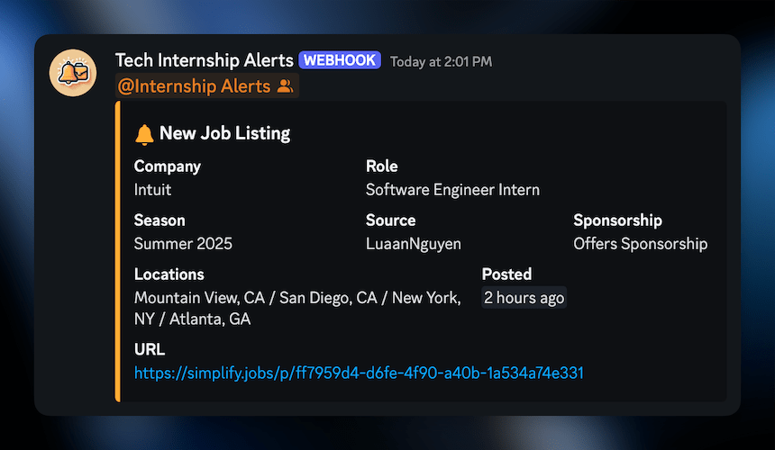

# 🔔 Tech Internship & New Grad Alerts

Continuously monitors GitHub repositories for internships and new grad roles with automatic Discord notifications. This project is inspired by [cvrve/internships-bot](https://github.com/cvrve/internships-bot) :)

## 🌱 Discord server

Join the [Discord server](https://discord.gg/P93Kc6jEKA) to get notified when new internships and new grad roles are posted!

## ✨ Features

- Pings a Discord role when a new internship or new grad listing is found
- Automatically edits alert embeds when a listing becomes inactive
- Adjustable cron job schedule via environment variable
- Monitor multiple GitHub repositories at once

## 🧞 Commands

All commands are run from the root of the project, from a terminal:

| Command | Action                |
| :------ | :-------------------- |
| `bun i` | Installs dependencies |
| `bun .` | Starts monitoring bot |

## 🧾 License

[MIT](https://choosealicense.com/licenses/mit/)
